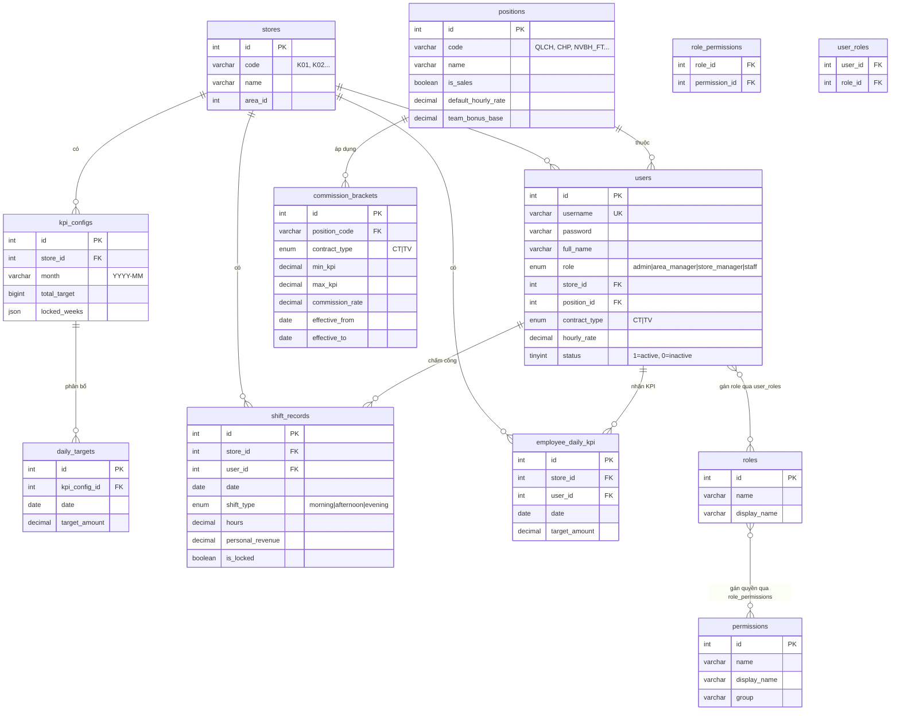
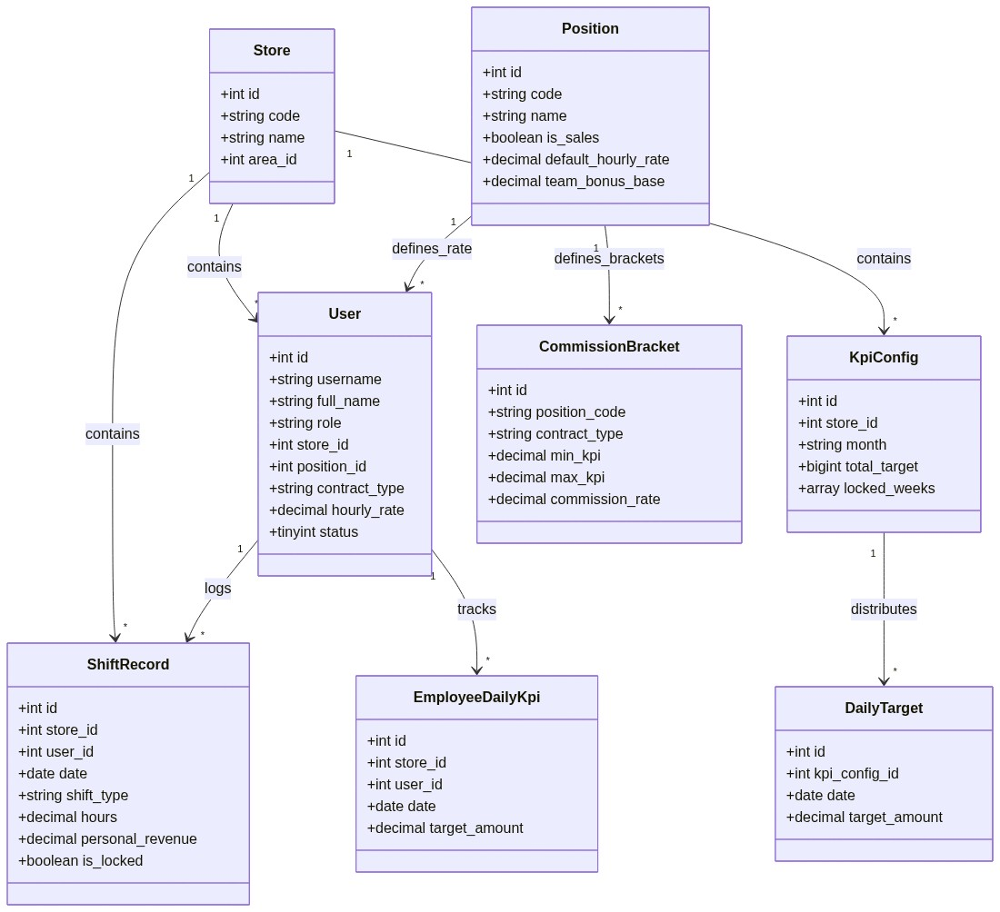
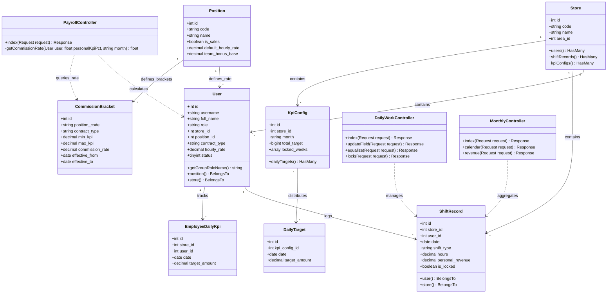

# Design Document — KRIK Staff Shift & KPI System

---

## 1. ERD — Entity Relationship Diagram



### Ký hiệu kết nối quan hệ
- `||--o{` : Quan hệ 1 - Nhiều (One-to-Many).
- `}o--o{` : Quan hệ Nhiều - Nhiều (Many-to-Many, qua bảng trung gian).
- `PK` / `FK` / `UK` : Khóa chính (Primary Key) / Khóa ngoại (Foreign Key) / Khóa duy nhất (Unique Key).

---


## 2. Class Diagram — Sơ đồ lớp (UML)

Sơ đồ lớp dưới đây thể hiện cấu trúc mã nguồn gồm các thuộc tính (fields), phương thức (methods) của các Model chính và sự tương tác điều hướng từ các Controller nghiệp vụ:





### Ký hiệu quan hệ trong UML Class Diagram
- `-->` : Quan hệ kết hợp (Association - chỉ hướng tham chiếu giữa các đối tượng).
- `..>` : Quan hệ phụ thuộc (Dependency - Controller gọi hoặc xử lý logic trên Model).
- `+` : Phương thức / Thuộc tính công khai (Public).
- `-` : Phương thức / Thuộc tính nội bộ (Private).

---


## 3. Permission Model

### Thiết kế
- **Role-based**: mỗi `user` có 1 `role` (admin / area_manager / store_manager / staff)
- **Permission-based bổ sung**: mỗi role được gán tập hợp permissions trong bảng `role_permissions`
- **Nguyên tắc ưu tiên**: **Role quyết định scope (bao nhiêu data)**, Permission quyết định **có vào màn hình không**

### Ma trận quyền chính

| Permission | Admin | Area Mgr | QLCH | CHP | NV thường |
|---|:---:|:---:|:---:|:---:|:---:|
| `manage_all_stores` | ✅ | | | | |
| `manage_own_store` | ✅ | ✅ | ✅ | | |
| `view_payroll_all` | ✅ | | | | |
| `view_payroll_store` | ✅ | ✅ | ✅ | ✅* | |
| `manage_staff` | ✅ | ✅ | ✅ | ✅ | |
| `lock_day` | ✅ | ✅ | ✅ | | |
| `configure_kpi` | ✅ | ✅ | | | |
| `admin_permissions` | ✅ | | | | |

> *CHP có `view_payroll_store` nhưng bị lock scope về store của mình theo role.

### Scoping Rules (quan trọng)
```
Bảng công ngày:
  admin/area_manager    → thấy store được chọn
  QLCH (store_manager)  → thấy toàn bộ NV store mình
  CHP/NV thường (staff) → chỉ thấy row của chính mình

Bảng lương / Tổng quan tháng:
  admin                 → dropdown tất cả stores
  area_manager          → stores trong khu vực
  QLCH/CHP/NV           → lock về store của mình (bất kể có permission view_payroll_all)
```

---

## 4. Xử lý Save-on-Blur Race Condition

### Vấn đề
Khi nhân viên nhập số liệu (giờ công, doanh thu) vào nhiều ô rồi chuyển focus nhanh, có thể xảy ra:
- Request 1 (giờ công) và Request 2 (doanh thu) gửi gần như đồng thời
- Response về sai thứ tự → UI hiện giá trị sai

### Giải pháp đã áp dụng

**1. Debounce 400ms tại frontend:**
```javascript
// Mỗi input chỉ trigger save sau 400ms không có keystroke mới
let saveTimer;
input.addEventListener('input', () => {
    clearTimeout(saveTimer);
    saveTimer = setTimeout(() => saveField(input), 400);
});
```

**2. Per-field request (không batch):**
- Mỗi field (hours, personal_revenue, customers...) gửi request độc lập
- Server UPDATE chỉ đúng 1 column → không bao giờ overwrite field khác

**3. Optimistic UI + rollback:**
```javascript
const oldVal = input.value;
fetch('/daily/update', { method: 'POST', body: ... })
  .then(r => r.ok ? showSaved(input) : rollback(input, oldVal))
  .catch(() => rollback(input, oldVal));
```

**4. Lock check tại server:**
```php
// Nếu ngày đã khoá → reject 403, không update DB
if ($record->is_locked) abort(403, 'Ngày đã khoá');
```

---

## 5. Trade-offs lớn nhất

### Trade-off 1: On-the-fly Payroll vs Cached Payroll

**Vấn đề**: Tính lương từ raw `shift_records` mỗi khi load `/payrolls` — nếu tháng có 30 ngày × 15 NV × 3 ca = 1.350 rows cần aggregate.

**Lựa chọn**: Tính on-the-fly (không cache)

**Lý do**:
- Data thay đổi thường xuyên trong tháng (nhập công hàng ngày)
- Cache sẽ stale ngay sau lần nhập tiếp theo
- 1.350 rows với MySQL index đủ nhanh (<100ms)
- Đơn giản hóa codebase — không cần invalidation logic

**Hạn chế**: Nếu chuỗi có 50+ store × 30+ NV, cần thêm cache layer (Redis) hoặc materialized view.

---

### Trade-off 2: Salary History vs Sync from Position

**Vấn đề**: Khi lương theo giờ thay đổi (ví dụ từ 25k → 27k), bảng lương tháng trước có bị ảnh hưởng không?

**Lựa chọn**: Lưu `hourly_rate` trực tiếp trên `users`, sync từ `position.default_hourly_rate` khi cập nhật chức danh.

**Lý do**: Đủ dùng cho giai đoạn hiện tại; tránh over-engineering.

**Hạn chế**: Không có lịch sử lương. Cần thêm bảng `user_salary_histories` nếu yêu cầu audit.

**Đề xuất tương lai**:
```sql
CREATE TABLE user_salary_histories (
  id INT PK,
  user_id INT FK,
  hourly_rate DECIMAL(10,2),
  effective_from DATE,
  effective_to DATE,
  created_by INT
);
```
